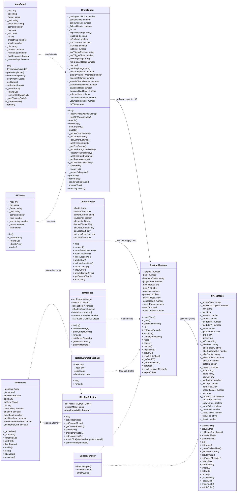

```mermaid
classDiagram
direction LR

%% =================== Core Engine ===================
class RhythmManager {
  - _loopIdx: number
  - bpm: number
  - feedbackStates: Array
  - judgeLineX: number
  - noteInterval: any
  - noteY: number
  - pauseAt: number
  - paused: boolean
  - scoreNotes: Array
  - scrollSpeed: number
  - speedFactor: number
  - startTime: null
  - totalDuration: number
  + resetState()
  + _now()
  + getElapsedTime()
  + _t()
  + setSpeedFactor()
  + initChart()
  + _emptyFeedback()
  + reset()
  + pause()
  + resume()
  + registerHit()
  + setBPM()
  + checkAutoMiss()
  + getScrollX()
  + getVisibleNotes()
  + getStats()
  + checkLoopAndRestart()
  + exportCSV()
}

class DrumTrigger {
  - _backgroundNoise: number
  - _cooldownMs: number
  - _debounceMs: number
  - _fallbackMode: boolean
  - _fft: null
  - _highFreqRange: Array
  - _isDebug: boolean
  - _isEnabled: boolean
  - _isInTransient: boolean
  - _isMobile: boolean
  - _initTime: number
  - _lastTriggerReason: string
  - _lastTriggerTime: number
  - _lowFreqRange: Array
  - _maxSustainRatio: number
  - _mic: null
  - _midFreqRange: Array
  - _noiseAdaptRate: number
  - _simpleVolumeThreshold: number
  - _spectralBalance: number
  - _sustainCheckFrames: number
  - _transientPeakLevel: number
  - _transientRatio: number
  - _transientStartTime: number
  - _volumeHistory: Array
  - _volumeHistorySize: number
  - _volumeThreshold: number
  - _onTrigger: any
  + init()
  + _applyMobileOptimizations()
  + _testFFTFunctionality()
  + enable()
  + setDebug()
  + setSensitivity()
  + update()
  + _updateSimpleMode()
  + _updateFullMode()
  + _getCurrentVolume()
  + _analyzeSpectrum()
  + _getFreqEnergy()
  + _updateBackgroundNoise()
  + _updateVolumeHistory()
  + _analyzeDrumFeatures()
  + _getRecentAverage()
  + _updateTransientState()
  + _isDrumHit()
  + _triggerHit()
  + _outputDebugInfo()
  + getStats()
  + resetStats()
  + renderDebugPanel()
  + manualTest()
  + runDiagnostics()
}

class SweepMode {
  - _accentColor: string
  - _archiveMaxCycles: number
  - _bar: string
  - _bg: string
  - _beatMs: number
  - _corner: number
  - _feedShiftX: number
  - _feedShiftY: number
  - _frame: string
  - _getFeedback: any
  - _glyph: any
  - _grid: string
  - _hitGlow: string
  - _labelFont: string
  - _labelShadow: string
  - _labelShadowBlur: number
  - _labelStroke: string
  - _labelStrokeW: number
  - _laneGap: number
  - _lastTs: number
  - _loopMs: number
  - _note: string
  - _notes: Array
  - _nowMs: any
  - _padBottom: number
  - _padTop: number
  - _permHits: Array
  - _phaseBiasMs: number
  - _rect: any
  - _showArchive: boolean
  - _showGrid: boolean
  - _showLanes: boolean
  - _showTicks: boolean
  - _speedMul: number
  - _startGapMs: number
  - _tickColor: string
  - _tickW: number
  + setHitGlow()
  + setBeatMs()
  + setJudgeThresholds()
  + showArchive()
  + clearArchive()
  + init()
  + setNotes()
  + _drawOutlinedText()
  + getCurrentCycle()
  + setStartGap()
  + setSpeedMultiplier()
  + clearHits()
  + addHitNow()
  + timeToX()
  + getBarX()
  + render()
  + _roundRect()
  + _drawGrid()
  + snapToLeft()
  + setHitColor()
}

class Metronome {
  - _pending: Array
  - _timer: null
  - beatsPerBar: any
  - bpm: any
  - buffers: Object
  - ctx: any
  - currentStep: number
  - enabled: boolean
  - lookahead: number
  - nextNoteTime: number
  - scheduleAheadTime: number
  - useInternalGrid: boolean
  + _schedule()
  + _advance()
  + scheduleAt()
  + setBPM()
  + flushFuture()
  + enable()
  + reset()
  + isLoaded()
  + onloaded()
}

%% =================== UI / HUD ===================
class ChartSelector {
  - charts: Array
  - currentChart: any
  - currentChartId: string
  - isLoading: boolean
  - elements: Object
  - loadedCharts: Map
  - onChartChange: any
  - onLoadStart: any
  - onLoadComplete: any
  - onLoadError: any
  + init()
  + createUI()
  + setupEventListeners()
  + openDropdown()
  + closeDropdown()
  + applyChart()
  + validateChartData()
  + showLoading()
  + showError()
  + updateButtonStyle()
  + getCurrentChart()
  + addChart()
}

class HitMarkers {
  - rm: RhythmManager
  - laneTopY: function
  - laneBottomY: function
  - isBottomDrum: function
  - hitMarkers: Marker[]
  - currentCycleIndex: number
  - MARKER_CONFIG: Object
  + init(cfg)
  + addHitMarker(ts)
  + clearCurrentCycle()
  + render()
  + setMarkerStyle(cfg)
  + getMarkerCount()
  + clearAllMarkers()
}

class NoteIlluminateFeedback {
  - CFG: any
  - _opts: any
  - colors: any
  - drawArrays: any
  + init()
  + render()
}

class AmpPanel {
  - _rect: any
  - _bg: string
  - _frame: string
  - _grid: string
  - _ampColor: string
  - _corner: number
  - _mic: any
  - _amp: any
  - _fft: any
  - _smoothing: number
  - _vscale: number
  - _hist: Array
  - _histMax: number
  - _historySec: number
  - _fastResponse: boolean
  - _instantAdapt: boolean
  + init()
  + tryEnableAmplitude()
  + preferAmplitude()
  + setFastResponse()
  + setDynamicScale()
  + getStatus()
  + setInstantAdapt()
  + _roundRect()
  + _drawBG()
  + _ensureHistCapacity()
  + _getEffectiveScale()
  + _currentLevel()
  + render()
}

class FFTPanel {
  - _rect: any
  - _bg: string
  - _frame: string
  - _grid: string
  - _corner: number
  - _bins: number
  - _smoothing: number
  - _vscale: number
  - _lift: number
  + init()
  + _roundRect()
  + _drawBG()
  + _drawXAxis()
  + render()
}

class RhythmSelector {
  - RHYTHM_MODES: Object
  - currentMode: string
  - dropdownVisible: boolean
  + init()
  + setMode(mode)
  + getCurrentMode()
  + getCurrentPattern()
  + getModes()
  + shouldPlayNote(...)
  + getNoteAccent(...)
  + shouldTick(eighthIndex, patternLength)
  + getAccent(eighthIndex)
}

class ExportManager {
  + handleExport()
  + captureFrame()
  + stitchQueue()
}

%% =================== Relationships (revised) ===================
DrumTrigger --> RhythmManager : onTrigger(registerHit)
RhythmManager --> SweepMode : setNotes()/sync
ChartSelector --> RhythmManager : initChart/applyChart
HitMarkers ..> RhythmManager : read timeline
NoteIlluminateFeedback ..> RhythmManager : feedbackStates
AmpPanel ..> DrumTrigger : mic/fft levels
FFTPanel ..> DrumTrigger : spectrum
Metronome ..> RhythmSelector : pattern / accents
%% （如要保留双向，再加） RhythmSelector --> Metronome : toggle patterns
RhythmSelector --> Metronome : toggle patterns
ExportManager ..> RhythmManager
ExportManager ..> SweepMode
```