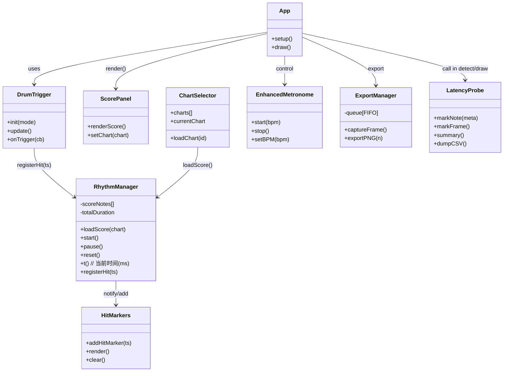

```mermaid
classDiagram
class App {
  +setup()
  +draw()
}
class DrumTrigger {
  +init(mode)
  +update()
  +onTrigger(cb)
}
class RhythmManager {
  +loadScore(chart)
  +start()
  +pause()
  +reset()
  +t()         // 当前时间(ms)
  +registerHit(ts)
  -scoreNotes[]
  -totalDuration
}
class HitMarkers {
  +addHitMarker(ts)
  +render()
  +clear()
}
class ScorePanel {
  +renderScore()
  +setChart(chart)
}
class ChartSelector {
  +charts[]
  +currentChart
  +loadChart(id)
}
class EnhancedMetronome {
  +start(bpm)
  +stop()
  +setBPM(bpm)
}
class ExportManager {
  +captureFrame()
  +exportPNG(n)
  -queue[FIFO]
}
class LatencyProbe {
  +markNote(meta)
  +markFrame()
  +summary()
  +dumpCSV()
}

App --> DrumTrigger : uses
DrumTrigger --> RhythmManager : registerHit(ts)
RhythmManager --> HitMarkers : notify/add
App --> ScorePanel : render()
App --> EnhancedMetronome : control
ChartSelector --> RhythmManager : loadScore()
App --> ExportManager : export
App --> LatencyProbe : call in detect/draw
```
