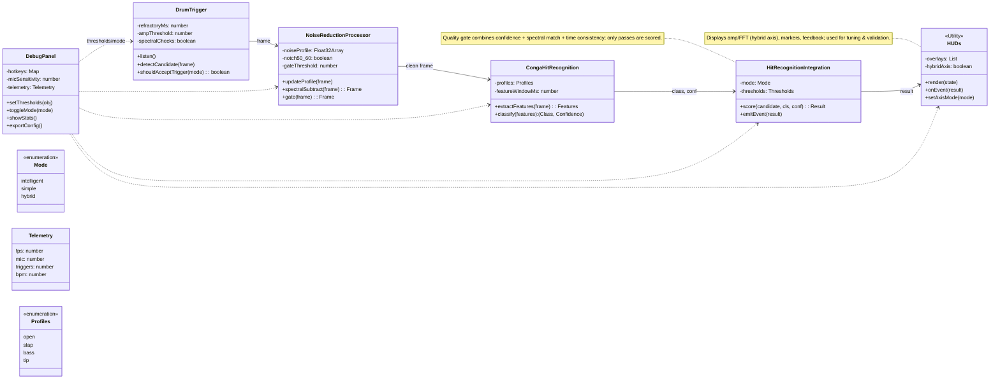

```mermaid
classDiagram
direction LR

class DrumTrigger {
  -refractoryMs: number
  -ampThreshold: number
  -spectralChecks: boolean
  +listen()
  +detectCandidate(frame)
  +shouldAcceptTrigger(mode): boolean
}

class NoiseReductionProcessor {
  -noiseProfile: Float32Array
  -notch50_60: boolean
  -gateThreshold: number
  +updateProfile(frame)
  +spectralSubtract(frame): Frame
  +gate(frame): Frame
}

class CongaHitRecognition {
  -profiles: Profiles
  -featureWindowMs: number
  +extractFeatures(frame): Features
  +classify(features): (Class, Confidence)
}

class HitRecognitionIntegration {
  -mode: Mode
  -thresholds: Thresholds
  +score(candidate, cls, conf): Result
  +emitEvent(result)
}

class HUDs {
  <<Utility>>
  -overlays: List
  -hybridAxis: boolean
  +render(state)
  +onEvent(result)
  +setAxisMode(mode)
}

class DebugPanel {
  -hotkeys: Map
  -micSensitivity: number
  -telemetry: Telemetry
  +setThresholds(obj)
  +toggleMode(mode)
  +showStats()
  +exportConfig()
}

class Mode {
  <<enumeration>>
  intelligent
  simple
  hybrid
}

class Telemetry {
  fps: number
  mic: number
  triggers: number
  bpm: number
}

class Profiles {
  <<enumeration>>
  open
  slap
  bass
  tip
}

%% 数据流（实线）
DrumTrigger --> NoiseReductionProcessor : frame
NoiseReductionProcessor --> CongaHitRecognition : clean frame
CongaHitRecognition --> HitRecognitionIntegration : class, conf
HitRecognitionIntegration --> HUDs : result

%% 控制/遥测（虚线）
DebugPanel ..> DrumTrigger : thresholds/mode
DebugPanel ..> NoiseReductionProcessor
DebugPanel ..> CongaHitRecognition
DebugPanel ..> HitRecognitionIntegration
DebugPanel ..> HUDs

note for HitRecognitionIntegration "Quality gate combines confidence + spectral match + time consistency; only passes are scored."
note for HUDs "Displays amp/FFT (hybrid axis), markers, feedback; used for tuning & validation."

```